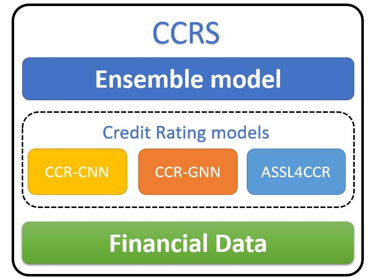
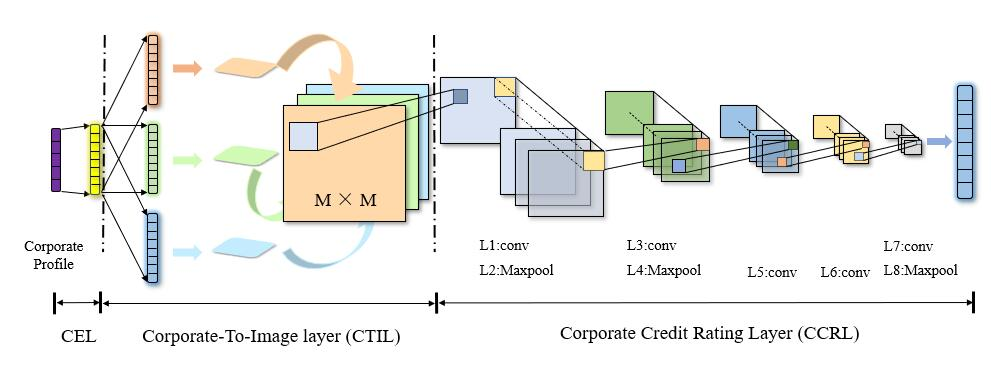
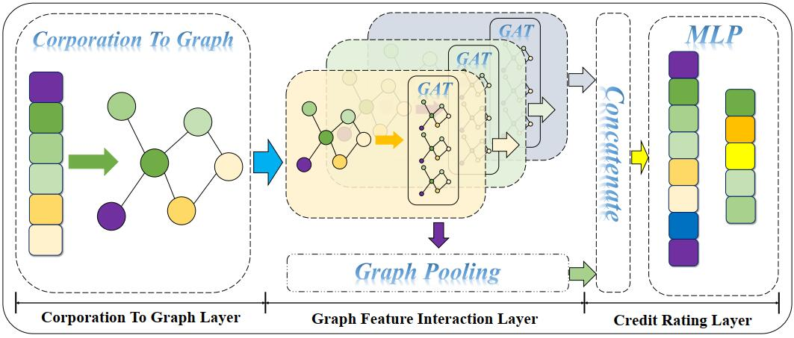
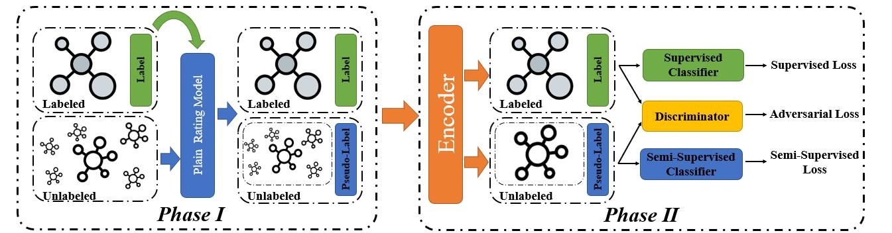

# Corporate Credit Rating System

## 1.Introduction
This is a corporate credit system based on deep learning models. The whole model concludes three moudules including Financial Data,Credit Rating models and Ensemble model  which shows in the following figure.

* Financial Data : This layer process the financial data as input.
* Credit Rating models: This moudules contains three rating models:CCR-CNN,CCR-GNN,ASSL4CCR
* Ensemble model: This layer enselbe the three models to predict final results by the way of bagging.

## 2.Credit Rating models
* **CCR-CNN** :  corporate credit ratings via convolution neural networks

[[pdf]](https://arxiv.org/abs/2012.03744)
* **CCR-GNN** : corporate credit ratings via Graph neural networks

[[pdf]](https://arxiv.org/abs/2012.01933)
* **ASSL4CCR** : Adversarial semi-supervised learning for corporate credit rating 

[[pdf]]()
## 3.model files
The model files can be downloaded from this [[link]](https://pan.baidu.com/s/1HeG6_Hf6X6sTc_2kmJ0x2g). (password:d8sa)
## 3.Financial Data Description
In our dataset, we use 39 features  and 9 rating labels: AAA, AA, A, BBB, BB, B, CCC, CC, C. These featuress include Profit Capability, Operation Capability, Growth Capability, Repayment Capability, Cash Flow Capability and Dupont Identity. It is shown as following tables:

* **Profit Capability(7)**
  |Feature|Feature Name|Description|
  |--- |-------- | :----- |
  |roeAvg|Return on net assets (average) (%)|Net profit attributable to shareholders of the parent company/[(Equity attributable to shareholders of the parent company at the beginning of the period + Equity attributable to shareholders of the parent company at the end of the period)/2]*100%|
  |npMargin|Sales margin(%)|Net profit/operating income*100%|
  |gpMargin|Gross profit margin (%)|Gross profit/operating income*100%=(operating income-operating cost)/operating income*100%|
  |netProfit|Net profit (RMB)||
  |epsTTM|Earnings per share|Net profit attributable to shareholders of the parent company TTM / latest total equity|
  |totalShare|Total Share||
  |liqaShare|Liquid Share||
* **Operation Capability(6)**
  |Feature|Feature Name|Description|
  |--- |-------- | :----- |
  |NRTurnRatio|Turnover rate of accounts receivable (times)|Operating income/[(Notes receivable and net receivables at the beginning of the period + Net notes receivable and receivables at the end of the period)/2]|
  |NRTurnDays|Accounts receivable turnover days (days)|Operating income/[(Notes receivable and net receivables at the beginning of the period + Net notes receivable and receivables at the end of the period)/2]|
  |INVTurnRatio|Inventory turnover rate (times)|Operating costs/[(Net inventory at the beginning of the period + Net inventory at the end of the period)/2]|
  |INVTurnDays|Inventory turnover days (days)|Quarterly report days/inventory turnover rate|
  |CATurnRatio|Liquid assets turnover rate (times)|Total operating income/[(current assets at the beginning of the period + current assets at the end of the period)/2]|
  |AssetTurnRatio|Turnover rate of total assets|Total operating income/[(total assets at the beginning of the period + total assets at the end of the period)/2]|
* **Growth Capability(5)**
  |Feature|Feature Name|Description|
  |--- |-------- | :----- |
  |YOYEquity|Year-on-year growth rate of net assets|(Current period's net assets-last year's net assets) / absolute value of last year's net assets * 100%|
  |YOYAsset|Year-on-year growth rate of total assets|(Total assets of the current period-total assets of the same period last year) / absolute value of the total assets of the same period last year * 100%|
  |YOYNI|Year-on-year growth rate of net profit|(Net profit for the current period-net profit for the same period last year) / absolute value of net profit for the same period last year * 100%|
  |YOYEPSBasic|Basic earnings per share year-on-year growth rate|(Basic earnings per share for the current period-basic earnings per share for the same period last year) / absolute value of basic earnings per share for the same period last year * 100%|
  |YOYPNI|Year-on-year growth rate of parent company’s shareholders’ net profit|(Net profit attributable to shareholders of the parent company for the current period-net profit attributable to shareholders of the parent company in the same period last year) / absolute value of the net profit attributable to shareholders of the parent company in the same period last year * 100%|
* **Repayment Capability(6)**
  |Feature|Feature Name|Description|
  |--- |-------- | :----- |
  |currentRatio|Current ratio|Current assets/current liabilities|
  |quickRatio|Quick ratio|(Current Assets-Net Inventory)/Current Liabilities|
  |cashRatio|Cash ratio|(Current Assets-Net Inventory)/Current Liabilities|
  |YOYLiability|Year-on-year growth rate of total liabilities|(Total liabilities for the current period-total liabilities for the same period of the previous year)/Absolute value of liabilities in the same period of the previous year * 100%|
  |liabilityToAsset|Assets and liabilities|Total liabilities/total assets|
  |assetToEquity|Equity Multiplier|Total assets/total shareholders' equity = 1/(1-asset-liability ratio)|
* **Cash Flow Capability(7)**
  |Feature Name|Description|
  |:---: |-------- |
  |CAToAsset|Current assets divided by total assets|
  |NCAToAsset|Non-current assets divided by total assets|
  |tangibleAssetToAsset|Tangible assets divided by total assets|
  |ebitToInterest|Earned interest multiple: profit before interest and tax/interest expense|
  |CFOToOR|Net cash flow from operating activities divided by operating income|
  |CFOToNP|Operating net cash flow divided by net profit|
  |CFOToGr|Operating net cash flow divided by total operating income|
* **Dupont Identity(8)**
  |Feature|Feature Name|Description|
  |--- |-------- | :----- |
  |dupontROE|Return on Equity|Net profit attributable to shareholders of the parent company/[(Equity attributable to shareholders of the parent company at the beginning of the period + Equity attributable to shareholders of the parent company at the end of the period)/2]*100%|
  |dupontAssetStoEquity|Equity multiplier, reflecting the strength of corporate financial leverage and financial risks|Average total assets/average equity attributable to the parent company|
  |dupontAssetTurn|Turnover rate of total assets, an indicator reflecting the efficiency of corporate asset management|Total operating income/[(total assets at the beginning of the period + total assets at the end of the period)/2]|
  |dupontPnitoni|Net profit/net profit attributable to shareholders of the parent company|Reflects the percentage of holding subsidiaries of the parent company. If the company invests more and expands its shareholding ratio, this indicator will increase.|
  |dupontNitogr|dupontNitogr|Net profit/total operating income, reflecting the profitability of the company’s sales|
  |dupontTaxBurden|dupontTaxBurden|The net profit/total profit reflects the level of corporate tax burden, and the higher the ratio, the lower the tax burden. Net profit/total profit = 1-income tax/total profit|
  |dupontIntburden|dupontIntburden|The total profit/profit before interest and tax reflects the interest burden of the enterprise, and the higher the ratio, the lower the tax burden. Total profit / profit before interest and tax = 1-interest expense / profit before interest and tax|
  |dupontEbittogr|dupontEbittogr|Profit before interest and taxes/total operating income, reflecting the operating profit rate of the company, is the percentage of the company's total operating income that can be distributed by all investors (shareholders and creditors)|
## 4.Model Performance
  |Model| Recall|Accuracy| F1-score|Model Size|
  |:-:|:-:|:-:|:-:|:-:|
  |**CCR-CNN**|0.92812|0.92812|0.92812|240M|
  |**CCR-GNN**|0.93437|0.95012|0.95177|83M|
  |**ASSL4CCR**|0.95312|0.96115|0.96252|8.5M|
## 5.Conclusion
  From CCR-CNN to ASSL4CCR, the size of model become smaller, but the performance is still not bad. This proves how powerful is the deep learning models.